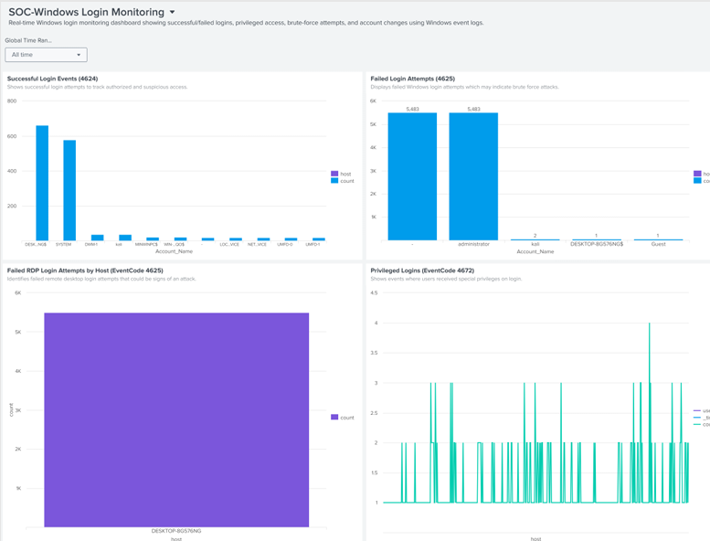
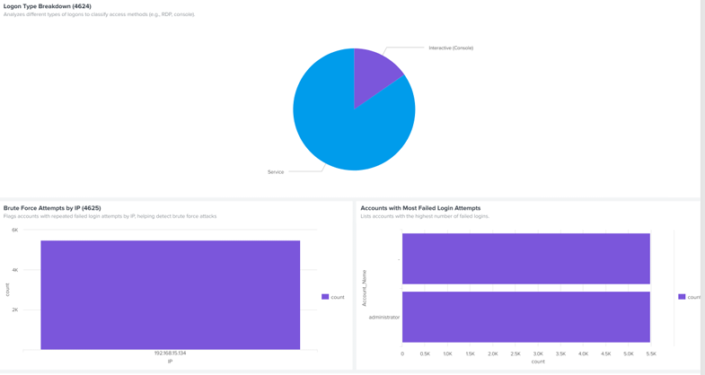

# 🛡️ Windows Login Monitoring with Real-Time Alerting in Splunk

## 📌 Project Overview

This project demonstrates a **Mini SOC (Security Operations Center)** built in **Splunk**, designed to monitor Windows login activity and trigger real-time alerts for suspicious behaviors.

---

## 🎯 Objective

- Detect failed/successful login attempts
- Monitor RDP brute-force attacks
- Detect privileged access (Event Code 4672)
- Raise real-time alerts for abnormal patterns
- Create a visual dashboard for Windows Security Log monitoring

---

## 🧰 Tools & Technologies

- Splunk Enterprise (local)
- Splunk Universal Forwarder
- Windows 10 (log source)
- SPL (Search Processing Language)

---

## 📊 Dashboard Panels

1. Failed Login Attempts (4625)
2. Successful Logins (4624)
3. RDP Brute Force Detection
4. Privileged Logins (4672)
5. Off-Hours Logins
6. Password Reset / Account Lock Events
7. Summary & Real-Time Alert Panel

> 🔗 Full panel details and SPL queries available in `notes/Splunk_Project_Notes.pdf`.

---

## 🚨 Real-Time Alerts

- **Privileged Logins Alert**
- **Brute Force Detection Alert**

Each alert was set with trigger conditions, throttle options, and tested for effectiveness.

> 📷 See `alert_screenshots/` for real-time alert configurations.

---

## 📥 Data Source

- Windows Security Logs via Splunk Universal Forwarder
- Event Codes used: `4624`, `4625`, `4672`, `4724`, `4725`, `4722`, etc.

---

## 📁 Notes & Documentation

📄 See: `notes/Splunk_Project_Notes.pdf` for a complete breakdown of:
- Dashboard panels
- SPL queries
- Real-time alert configuration
- Project explanation

---

## 📌 Use Case

This project simulates real-world SOC use:
- Helps SOC Analysts monitor logins in real-time
- Quick identification of brute-force attempts and unauthorized access
- Use in resumes, interviews, or portfolio

---

## 📷 Screenshots

---

## 📫 Contact

If you'd like help setting up your own mini SOC or Splunk lab, feel free to connect.

---

